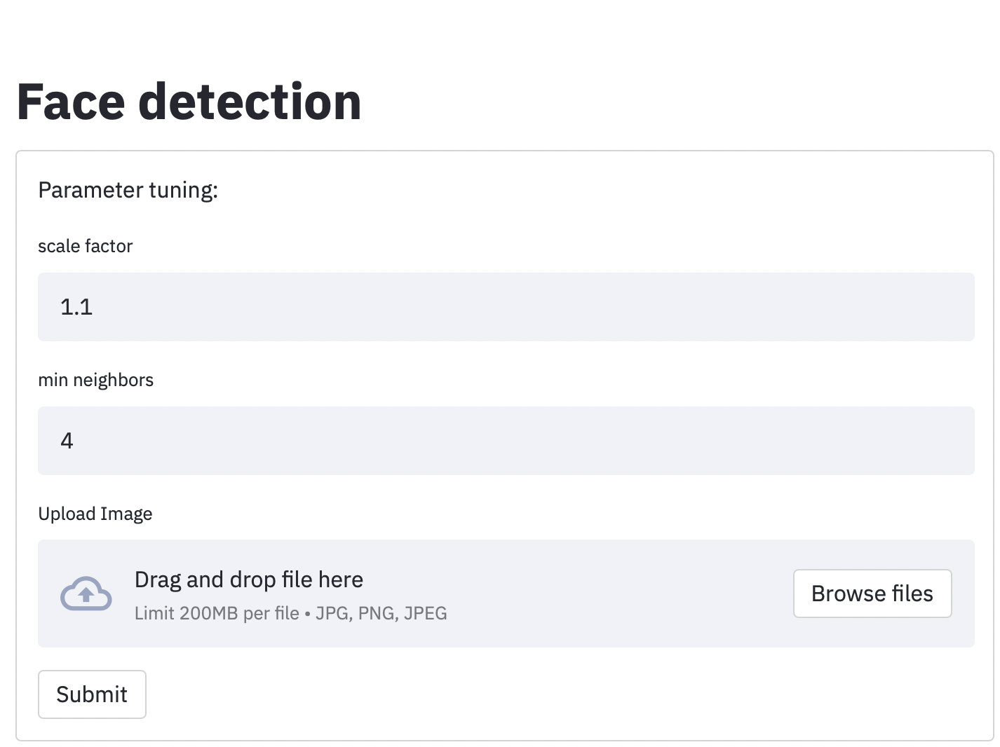
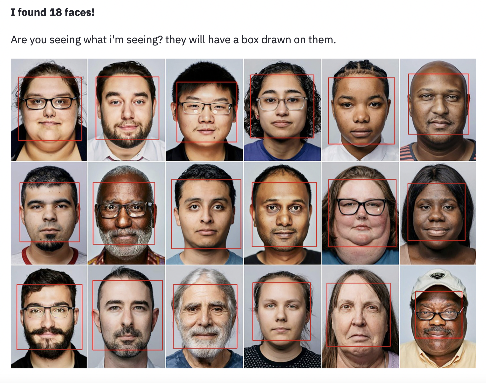

# FaceDetectionImages
Web app in streamlit that detects faces in images. Using Haar Cascades. Haar-like features are digital image features used in object recognition. They owe their name to their intuitive similarity with Haar wavelets and were used in the first real-time face detector. 





## Instructions

1. Clone
2. Navigate to the location of the .py file
3. Type:
```
streamlit run face_detection.py
```


Open a web browser to http://localhost:8501

<hr>

### Docker
```
#build docker image
docker build -t face_detector:v1 .
```

```
#run docker image
docker run -it -p 5000:5000 --gpus all face_detector:v1
```
Download, make changes, enjoy!

# Questions?
<br>

